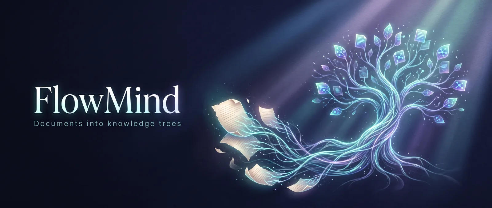
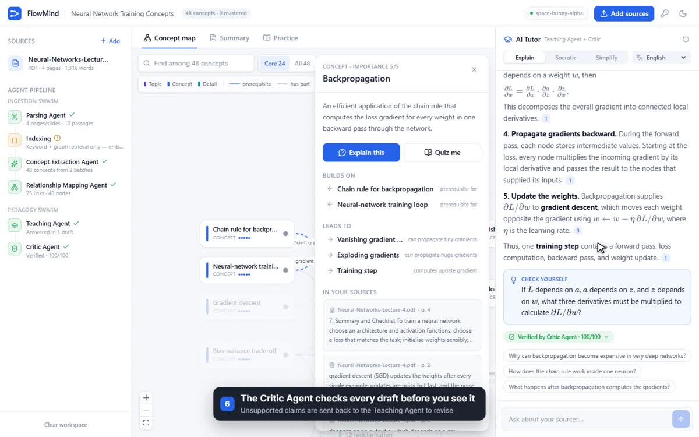
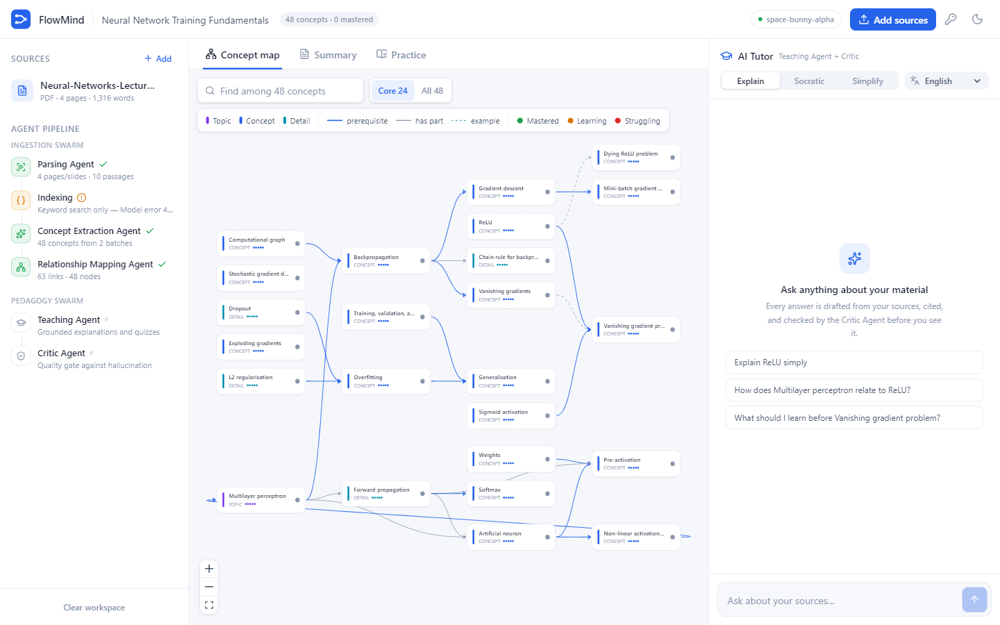
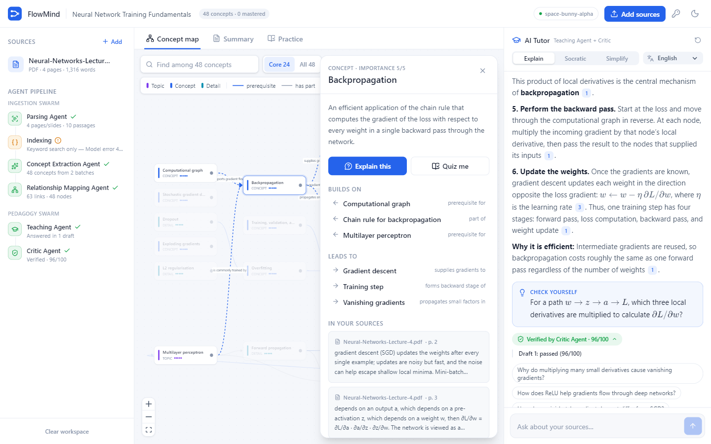
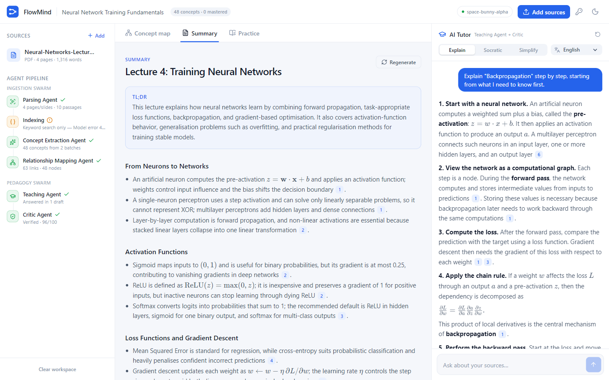
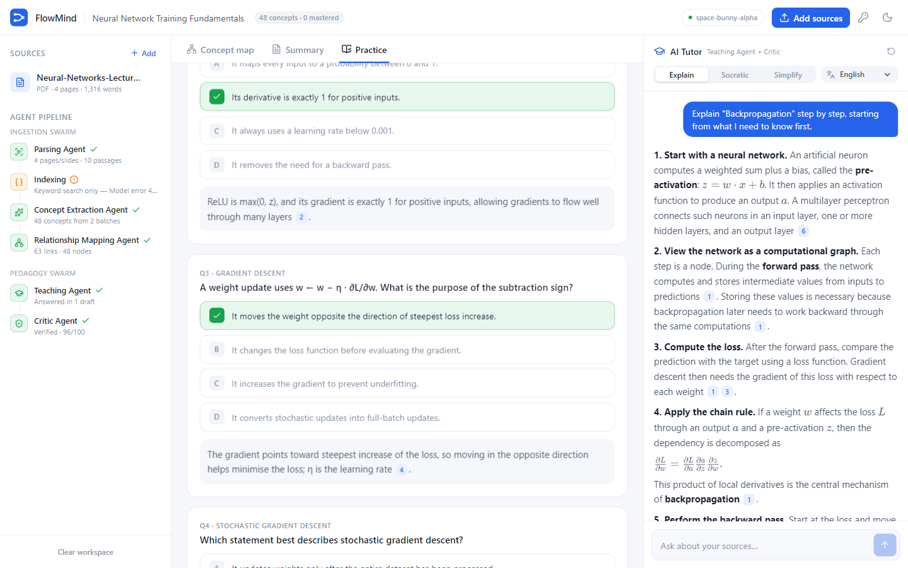
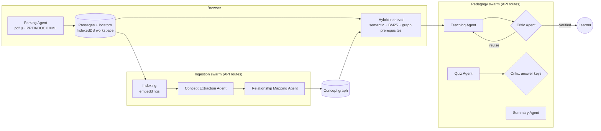

<p align="center"></p>

# FlowMind

**Dense lecture PDFs → an interactive concept map and an AI tutor you can trust.**

FlowMind is a single website with no landing page or setup: it opens straight into the workspace. Drop in
lecture PDFs, slide decks, Word documents or notes. A multi-agent pipeline turns them into a concept graph that
shows how ideas connect, cited summaries, adaptive quizzes, and a tutor whose answers are checked by a Critic
Agent before you see them.

<a href="docs/demo/flowmind-demo.mp4"></a>

<sub>60-second walkthrough of the real app (model waits are sped up). File: [`docs/demo/flowmind-demo.mp4`](docs/demo/flowmind-demo.mp4)</sub>

## What it does

| | |
| --- | --- |
|  | **Concept map.** Concepts become nodes; prerequisite, part-of and example links become edges. Large libraries open on the 24 core concepts (toggle *All*), the layout picks whichever direction fits the screen, and nodes are coloured by type and by your mastery. |
|  | **Critic-verified tutor.** The Teaching Agent drafts an answer from the retrieved passages; the Critic Agent checks it for unsupported claims and sends it back for revision if needed. Every sentence carries clickable citations to the page or slide it came from. Explain, Socratic and Simplify modes; 12 answer languages; KaTeX maths. |
|  | **Cited summaries.** TL;DR, structured sections and key terms, each bullet linked to its source passage. |
|  | **Adaptive practice.** Multiple-choice questions and flashcards, whose answer keys the Critic re-checks. Your answers mark concepts as mastered or struggling, and the tutor takes extra care with the ones you struggle on. |

More screenshots: [empty state](docs/screenshots/01-empty-state.png) · [ingestion](docs/screenshots/02-ingesting.png) ·
[concept panel](docs/screenshots/04-concept-panel.png) · [citation](docs/screenshots/08-citation.png) ·
[flashcards](docs/screenshots/11-flashcard.png) · [dark mode](docs/screenshots/13-dark.png) ·
[mobile map](docs/screenshots/14-mobile-map.png) · [mobile tutor](docs/screenshots/15-mobile-tutor.png) ·
[the FlowMind deck + pilot report as sources](docs/screenshots/16-your-materials-map.png) ([summary](docs/screenshots/17-your-materials-summary.png))

## The agents

This is the dual-swarm design from the FlowMind capstone presentation, implemented as one Next.js app:



- **Parsing** runs in the browser, so large PDFs never hit an upload limit and documents are never stored on a server.
  Every passage keeps a locator (`p. 4`, `slide 7`, `§ Section`) for citations.
- **Ingestion** is orchestrated from the browser as short API calls, so each agent's progress is visible in
  the pipeline panel and no call runs into serverless time limits.
- **Retrieval** blends embedding similarity with BM25, then pulls in passages for prerequisite concepts from the
  graph, which are logically needed even when they are not textually similar. Without embeddings it falls back to
  keyword + graph retrieval.
- **The Critic's quality gate** runs up to three drafts. The tutor streams each stage (retrieval → draft →
  critic verdict → revision) and shows the critic trace with the answer.

## Benchmark

`npm run bench` scores the whole pipeline on the sample lecture ([method and full results](bench/README.md)):

| Metric | Result |
| --- | ---: |
| Gold concept recall / link recall | 93.3 % / 60 % |
| Tutor answer accuracy (14 questions) | 100 % |
| Out-of-scope questions declined / fabricated | 100 % / 0 % |
| Answers with valid citations | 100 % |
| Answers verified by the Critic (revised first) | 100 % (38 %) |
| Answers in requested language (Sinhala, Spanish) | 100 % |
| Quiz answer keys correct | 100 % |
| Tutor latency p50 / p90 | 27 s / 46 s |

<sub>OpenRouter `stealth/space-bunny-alpha` (free) with `nvidia/nemotron-3-embed-1b:free`, 30 Sep 2026. Small smoke-level benchmark; see the caveats in bench/README.md.</sub>

## Run it

```bash
cp .env.example .env.local        # add OPENROUTER_API_KEY=sk-or-... or MISTRAL_API_KEY=...
npm install
npm run dev                       # http://localhost:3000
```

Then click **Try the sample lecture**, or drop in your own files. Without a server key, visitors can paste their
own OpenRouter or Mistral key in Settings (🔑); it stays in their browser.

| Command | |
| --- | --- |
| `npm run dev` / `npm run build && npm start` | Develop / production |
| `npm test` | Unit tests (retrieval, chunking, citation + maths rendering, JSON repair) |
| `npm run lint` · `npm run typecheck` | Static checks (also run in CI) |
| `npm run bench` | Grounding benchmark against a running server |

Deployment (Vercel, Docker, any Node host): see [DEPLOYMENT.md](DEPLOYMENT.md).

## Layout

```text
src/app/                 page + API routes (/api/embed, /api/agents/{concepts,relations,tutor,summary,practice})
src/components/          workspace UI: sidebar pipeline, concept map, concept panel, tutor, summary, practice
src/lib/parse.ts         Parsing Agent (PDF/PPTX/DOCX/MD/TXT → cited passages)
src/lib/retrieval.ts     hybrid retrieval + graph expansion
src/lib/client.ts        ingestion orchestration, API client, NDJSON stream reader
src/lib/server/          provider-neutral model client (OpenRouter / Mistral) and agent prompts
bench/                   grounding benchmark + results
docs/                    screenshots, demo video, sample-PDF generator, legacy PathTree docs
```

The earlier two-service version (Next.js frontend + Python/FastAPI on Modal) was replaced by this single app;
its documentation is kept in `docs/legacy/`.

## License

MIT
